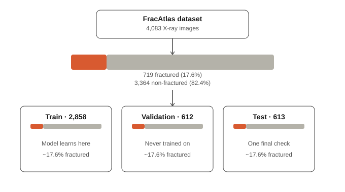

# OstEval

An educational demo app that estimates probabilities of common bone conditions (fracture, osteoarthritis, osteoporosis) from an X-ray, with confidence scores and visual explanations. Not a diagnostic tool.

## Requirements

- Python 3.12 (PyTorch's stable release doesn't yet support Python 3.14)

## Tech stack

**Frameworks:** FastAPI, Uvicorn

**Libraries:** torch, torchvision, numpy, pandas, scikit-learn, python-multipart, pillow, grad-cam, slowapi

## Setup

    python -m venv venv
    venv\Scripts\activate        # Windows
    pip install -r backend/requirements.txt

`requirements.txt` lists every package above with its exact installed version, so anyone cloning this repo can reproduce the same environment. The `venv/` folder itself is not committed — it's rebuilt locally from this file.

## Warm-up practice

Before working on the real bone X-ray models, `warmup/pneumonia_classifier.py` is a
practice script that trains a chest X-ray pneumonia classifier using transfer
learning on ResNet18. It's unrelated to the final app — it exists purely to build
familiarity with the PyTorch training pipeline before applying the same approach
to real bone disease datasets. Full writeup of the approach and results is in the
script's docstring.

## Data preparation

`ml/data/prepare_fracture.py` builds the labeled train/validation/test split for
the fracture dataset (FracAtlas). The dataset is imbalanced — only 17.6% of
images show a fracture — so the split is stratified, meaning each of the three
groups preserves that same ~17.6% ratio rather than risking an uneven split by
chance:

See the script's docstring for the full reasoning, including why the dataset's
own provided split wasn't used, and exact steps to reproduce the download. This practice (stratification) is repeated/followed in the data preparation scripts for the Osteoarthritis and Osteoporosis datasets.

## What's excluded from version control (.gitignore)

- `venv/` — the virtual environment, large and reproducible from requirements.txt
- `__pycache__/`, `*.pyc` — Python's auto-generated bytecode cache
- `ml/data/*_raw/`, `ml/data/*.csv` — downloaded datasets and derived labels (large, some licensed)
- `ml/models/*.pt`, `backend/models/*.pt` — trained model weights (large, regenerated by training)
- `results/*.png` — temporary per-request heatmaps and uploaded images
- `.DS_Store` — macOS system file
