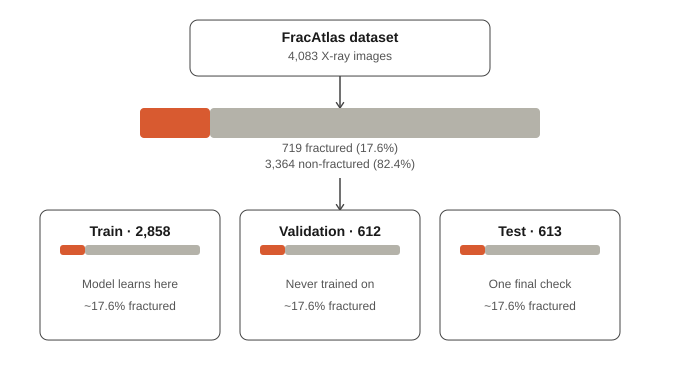

# OstEval

An educational demo app that estimates probabilities of common bone conditions (fracture, osteoarthritis, osteoporosis) from an X-ray, with confidence scores and visual explanations. Not a diagnostic tool.

## Requirements

- Python 3.12 (PyTorch's stable release doesn't yet support Python 3.14)

## Tech stack

**Frameworks:** FastAPI, Uvicorn

**Libraries:** torch, torchvision, numpy, pandas, scikit-learn, python-multipart, pillow, grad-cam, slowapi

## Setup

    python -m venv venv
    venv\Scripts\activate        # Windows
    pip install -r backend/requirements.txt

`requirements.txt` lists every package above with its exact installed version, so anyone cloning this repo can reproduce the same environment. The `venv/` folder itself is not committed — it's rebuilt locally from this file.

## Warm-up practice

Before working on the real bone X-ray models, `warmup/pneumonia_classifier.py` is a
practice script that trains a chest X-ray pneumonia classifier using transfer
learning on ResNet18. It's unrelated to the final app — it exists purely to build
familiarity with the PyTorch training pipeline before applying the same approach
to real bone disease datasets. Full writeup of the approach and results is in the
script's docstring.

## Data preparation

Each disease has its own data preparation script under `ml/data/`, which downloads
the labeled dataset and builds a stratified train/validation/test split — keeping
each class's proportion consistent across all three groups rather than risking an
uneven split by chance:

- `prepare_fracture.py` — FracAtlas, fracture detection (imbalanced: ~17.6% fractured)
- `prepare_oa.py` — SilpaCS/kneeosteoarthritis, osteoarthritis grading 0-4 on the Kellgren-Lawrence scale (imbalanced: Grade 4 only ~3% of the dataset)
- `prepare_osteoporosis.py` — Multi-Class Knee Osteoporosis X-Ray Dataset, osteoporosis classification (imbalanced: Osteopenia only ~19% of the dataset)

Example diagram for the FracAtlas dataset split:

See each script's docstring for full reasoning — dataset sourcing decisions,
class balance, and exact steps to reproduce the download.

## Planned app flow

Mockups of the upload page, results page, and the backend process that runs
behind them (body-part routing, model inference, Grad-CAM explainability,
and image cleanup). This reflects the intended design — the backend and
frontend are not yet built; data preparation for the three disease models is
complete, and training is in progress.

[OstEval app flow mockup](docs/images/app-flow-mockup.png)

## What's excluded from version control (.gitignore)

- `venv/` — the virtual environment, large and reproducible from requirements.txt
- `__pycache__/`, `*.pyc` — Python's auto-generated bytecode cache
- `ml/data/*_raw/`, `ml/data/*.csv` — downloaded datasets and derived labels (large, some licensed)
- `ml/models/*.pt`, `backend/models/*.pt` — trained model weights (large, regenerated by training)
- `results/*.png` — temporary per-request heatmaps and uploaded images
- `.DS_Store` — macOS system file
